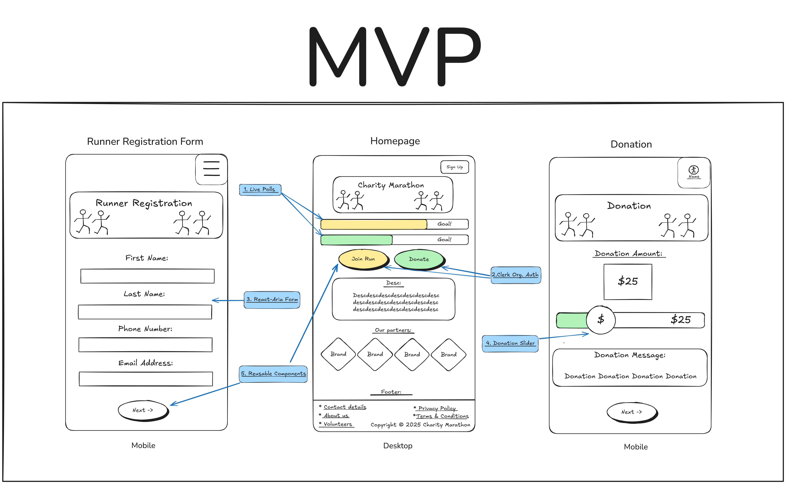
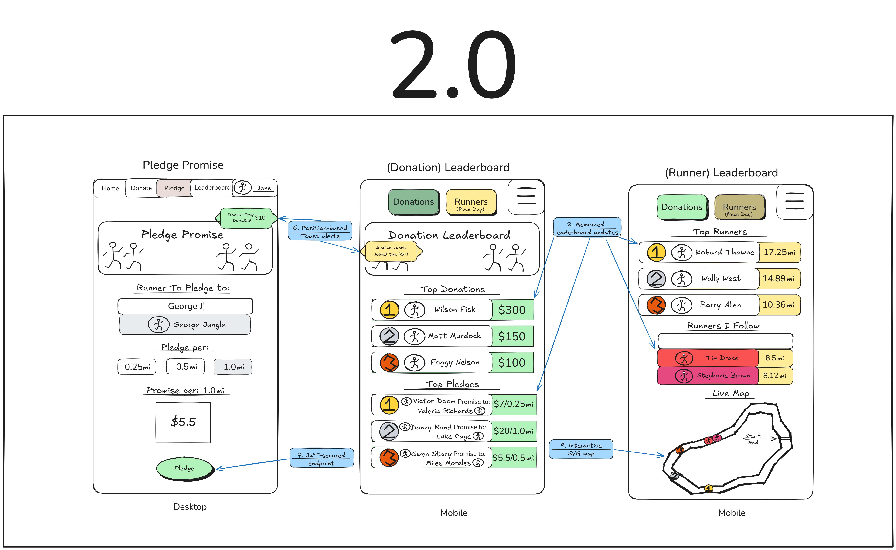

# Charity Marathon Tracker 🏃💨

[](https://astro.build)
[](https://react.dev)

**Real-time charity marathon tracking platform with donor engagement and live participant updates**

---

## 📖 Project Overview
A Greenfield project enabling real-time tracking/displaying of charity marathon participants and donation progress. Built with performance, accessibility, and reusability as focal points.

Featuring:
- Live donor/runner metrics
- Role-based authentication
- Mobile-first interactive components
- Real-time visualizations
- Scalable API architecture

**Target Users**: Marathon organizers, participants, and donors

---

## 🛠️ Tech Stack & Justification

| Tool              | Purpose                                  | Key Benefit                          |
|-------------------|------------------------------------------|--------------------------------------|
| **Astro**         | Base framework with islands architecture | Partial hydration for fastest speed |
| **React Compiler**| Component optimization                   | Automatic memoization                |
| **Clerk**         | Auth & organization management           | Pre-built secure workflows           |
| **React Aria**    | Accessible components                    | WCAG compliance                      |
| **Playwright**    | Cross-device testing                     | Reliable mobile gestures             |
| **Visx**          | Data visualization                       | Lightweight SVG charts               |
| **Redux Toolkit** | State management (V2)                    | Predictable data flow                |
| **JWT**           | API security (V2)                        | Stateless auth                       |

---

## 🎯 Core Features

### MVP Features
1. **Live Polls**  
   Real-time donation counter & runner registration counter using Astro islands
2. **Clerk Org. Auth**  
   Role-based access (Runners vs Donors) with social login
3. **React-Aria Form**  
   Accessible runner registration with keyboard maneuverability
4. **Donation Slider**  
   Mobile-friendly UI for adjustable donations
5. **Reusable Components**  
   Component library with TypeScript contracts

### 2.0 Features
6. **Position-Based Toasts**  
   pop-up(toast) notifications (left=runner, right=donor)
7. **JWT-Secured Endpoints**  
   Protected pledge signup API
8. **Memoized Leaderboard**  
   React Compiler-optimized updates
9. **Interactive SVG Map**  
   Live runner positions with Visx/React Aria

---

## 🖼️ Wireframes

### MVP Layout


**Key Annotations**:
1. Live poll update zones (Hydration boundaries)
2. Auth trigger points
3. Acessible runner signup
4. Mobile gesture component
5. Typescript contracts on React components

### 2.0 Enhancements


**Key Annotations**:
6. Toast notification positions
7. JWT-secured modal flows
8. Performance metrics overlays
9. SVG map interaction points

---

## 🚀 Installation

```bash
git clone https://github.com/yourusername/marathon-tracker.git
cd marathon-tracker
npm install
npm run dev
